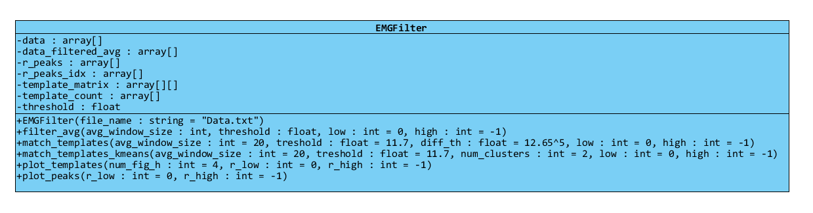
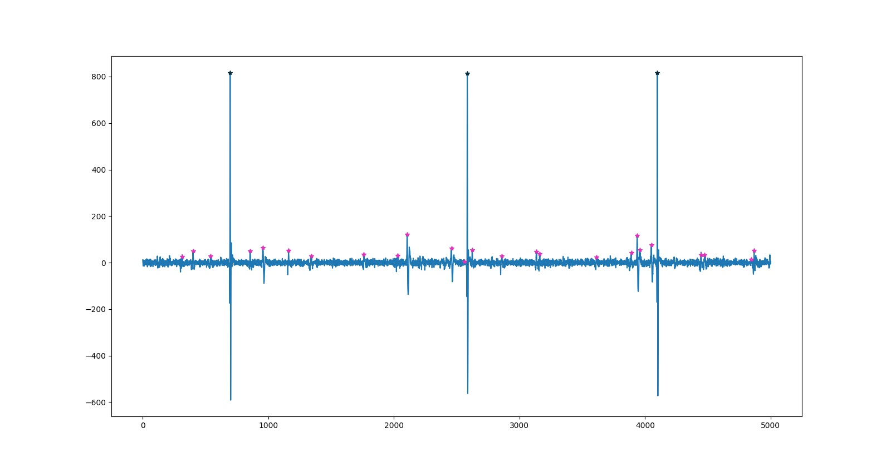
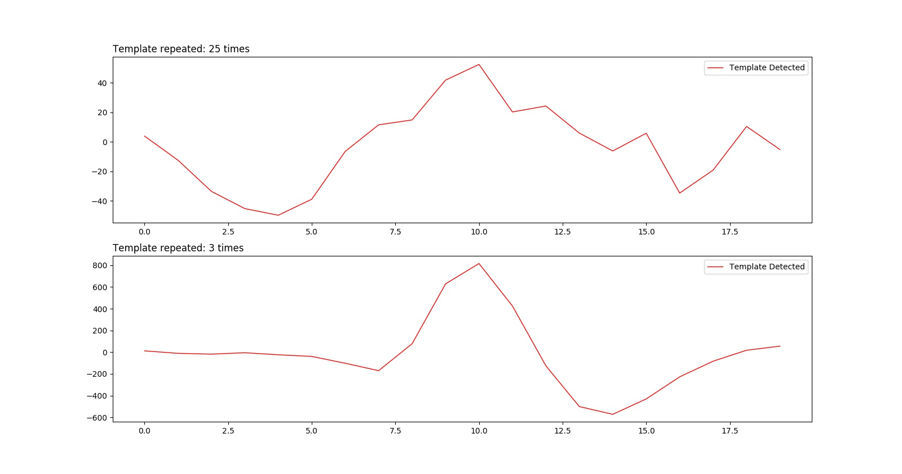
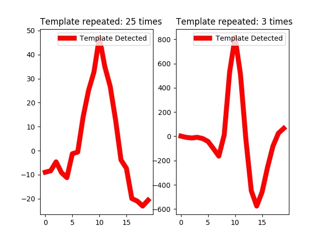
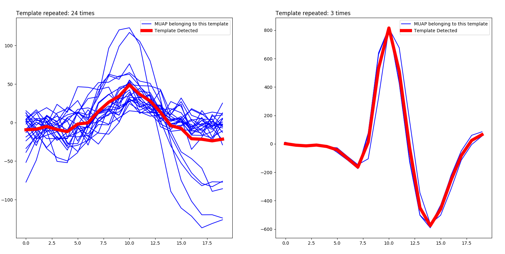
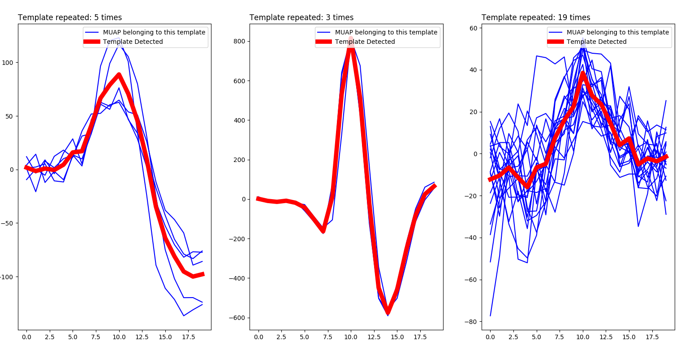

# Biomedical Engineering Assignment 2
## Name: Abdelrahman Mohamed Abdelhamid Ali Elbehery
## Section : 2
## ID : 1300759
## Table of contents


## How to use
+ You need a `python 2.7 interpreter`
+ From terminal type `python code.py`
    + Note the code assumes  `/Data.txt` exist at the same code otherwise the proper directory should be given at the class constructor and methods
+ The output images are generated at the same directory of the code file `main_code.py`

---

## Class diagram

The code uses a single class `EMGFilter` that defines all the proper operations to be done on the noisy given ElectroMyoGraphic \[**EMG**\] signal. The operations include
+ Signal rectification and moving average given `T` the window size
+ A template matching algorithm
+ A K-means clustering based algorithm for detecting different Motor unit action potentials \[**MUAPs**\]


 
  ## Attributes
+ `data` : np.array that containts the sampled ECG data,
exist only for visualization and debugging
+ `data_filtered_avg` : np.array that contains the sampled filtered data after applying moving window with size N
+ `r_peaks` : np.array that contains the peak indeces of the EMG
+ `r_peaks_idx` : np.array that contains the index number of each peak
+ `template_matrix` : numpy 2d array where each row represent a detected template
a vectorized difference operation is done over this array to match other templates
+ `template_count` : a numpy 1D array that holds the number of occurrences of each template.
This attribute is used to check if such a template is being repeated often or
it is a superposition. Also a zero value means we dont have to draw such patteren
+ `threshold` : User given TH for detecting rectified EMG signal peaks

## Methods
+ `filter_avg` : performs the signal rectification and moving average
+ `match_templates` : implements the template matching algorithm for detecting different MUAPs given threshold `T`
+ `match_templates_kmeans` : implements a k-means clustering based algorithm for detecting different MUAPs given threshold `T`
+ `plot_templates` : plots all the detected templates \[either detected by the k-means method or the plain template matching\]
+ `plot_peaks` : plots all the detected peaks over the corresponding signal sample of them


## Algorithms details


### Template matching \[Non-kmeans\]

```py
# synchronies the peak in the middle of the signal
dist = int(avg_window_size//2)
# holds the colors of each template
_last_winner = []
for p_idx, t_idx in enumerate(self.r_peaks_idx):
    if t_idx < low or t_idx > high:
        # we are out of the bounds given
        continue
    # extract the template around the peak
    template = self.data[t_idx-dist:t_idx+dist]
    # now calculate the distance between all the detected samples and this template [Vectorized]
    dist_vect = np.sum((self.template_matrix - template)**2, axis=1) < diff_th
    # pick the winning index
    win_idx = np.argmax(dist_vect)
    # in case this index points to false [non exceeds the threshold]
    # or the corresponding location had no templates we need to create a new one
    if dist_vect[win_idx] == 0 or self.template_count[win_idx] == 0:
        # None of the templates matched this one, add it into the template matrix
        self.template_matrix[next_temp_pos, :] = template
        # Now declare that we have found one instance of such template
        self.template_count[next_temp_pos] = 1
        # assign some random color to these group of points
        clr = np.random.random(3)
        self.r_peaks_clrs[p_idx, :] = clr
        # increment the next position pointer
        next_temp_pos += 1
        # used internally to assign colors for each peak
        _last_winner.append(clr)
        continue
    # we have found a winner, increment the number of occurrences
    self.template_count[win_idx] += 1
    # assign the same color as its peers
    self.r_peaks_clrs[p_idx, :] = _last_winner[win_idx]
    # then update this template to be the new one [SLIDE 13]
    self.template_matrix[win_idx, :] = template
```

A vectorized algorithm for comparing all the detected templates versus the current selected one is implemented utilizing `numpy` matrix vector operations. While looping over each template it assigns colors for the templates within the same neighbors. This is only needed in case we are trying to plot the peaks with colors declaring peaks belonging to the same template.

---
### Template matching \[Kmeans based\]

The code starts first by building a data-set, just a matrix with rows corresponds to samples and columns corresponds to features. A sample has `T` feature where `T` is the window size. Based on the previous calculations performed by the averaging method it is guaranteed that the maximum peak is the middle feature \[Signals are sync.\]

```py
dist = int(avg_window_size//2)
for p_idx, t_idx in enumerate(self.r_peaks_idx):
    # build the data-set
    data_set[p_idx, :] = self.data[t_idx-dist:t_idx+dist]

# now use sklearn clustering algorithm to figure out `N` clusters for the
# given data-set
self.kmeans = KMeans(n_clusters=num_clusters).fit(data_set)

# which sample belongs to which template
u,c = np.unique(self.kmeans.labels_, return_counts=1)

# now these are the detected templates [centers]
self.template_matrix = self.kmeans.cluster_centers_
# now we need a random matrix [for the colors] a row for each cluster
# and number of cols = 3 [r, g, b]
clrs = np.random.random([u.shape[0],3])
# now assign to each peak a color [used for plotting only]
self.r_peaks_clrs = clrs[self.kmeans.labels_]
```

Each cluster is assign a color for its neighbors. Each peak belonging to a cluster has its own color when plotted via `.plot_peaks()`

---

### Moving average

```py
# for zero indexing
avg_window_size -= 1

# take the current sub-array from the filtered data as the window
self.data_filtered_avg = np.copy(self._data_filtered[avg_window_size:])

# Vector operation per window size to sweep and add all the array items together
for i in range(avg_window_size):
    self.data_filtered_avg += self._data_filtered[i:-avg_window_size+i]
self.data_filtered_avg /= avg_window_size

# prepare the array of peaks
self.r_peaks = np.zeros([self.data_filtered_avg.shape[0],])
```

The algorithm loops through the sampled data items and it moves by a step `avg_window_size`. The algorithm will always select the highest peak within the average window as the R-peak

---

## Deliverables and outputs

### Problem 1
#### DetectedMUAP.jpg



#### Templates.jpg




### Problem 2
#### DetectedMUAP_K.jpg


#### Templates_K.jpg



---

## Observations

When plotting each cluster center against all its neighbors, it turns out the `k=3` is the perfect choice. In the figure below the plot shows the cluster centers \[in bold red\] and each cluster neighbors \[in blue\] for `k=2`



I have noticed some of the peaks belinging to the cluster on the left had a larger magnitude \[close to 100\] so when increasing `k=3` the cluster centers and their neighbors seems more accurate as shown below



When increasing `k` almost the same graph shows but with a `1` or `2` samples belonging to the introduced cluster. So the obvious number for `k` is `3`