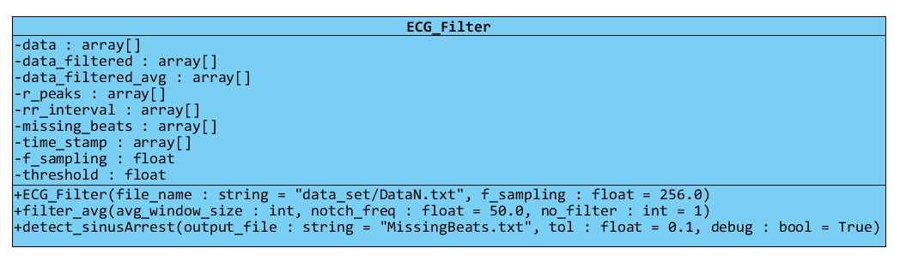
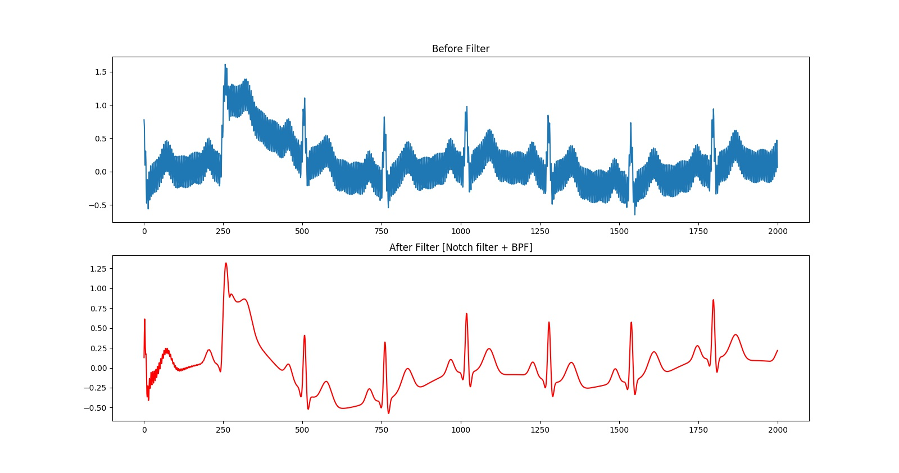
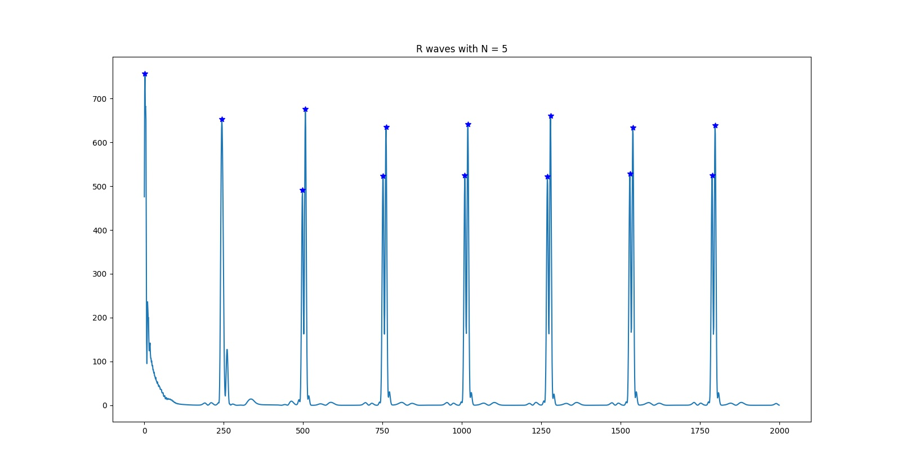
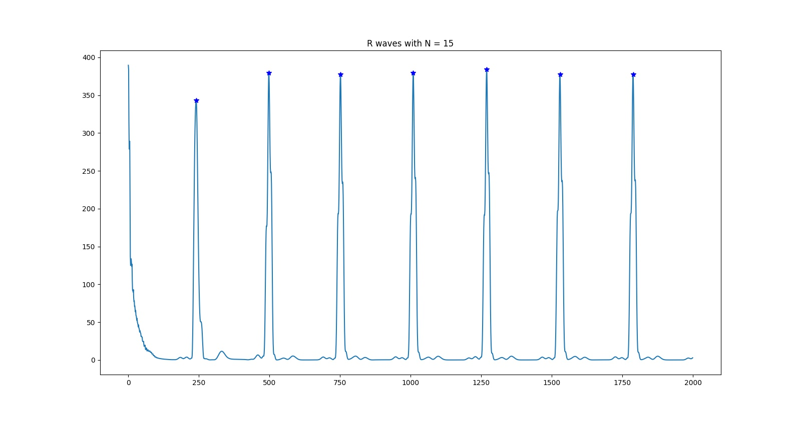
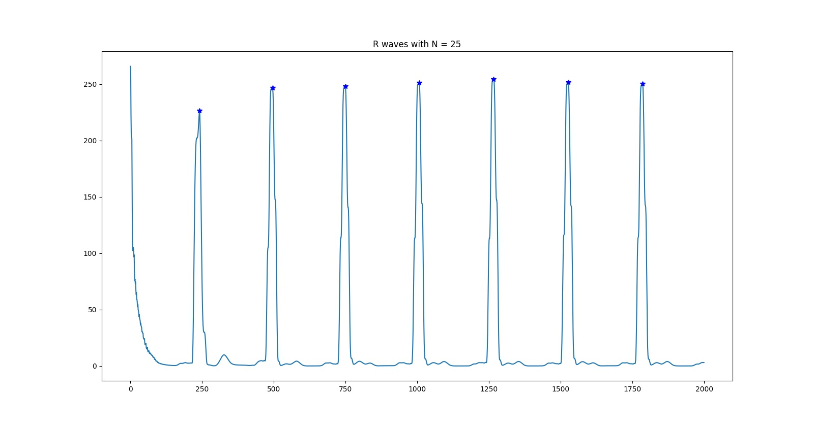
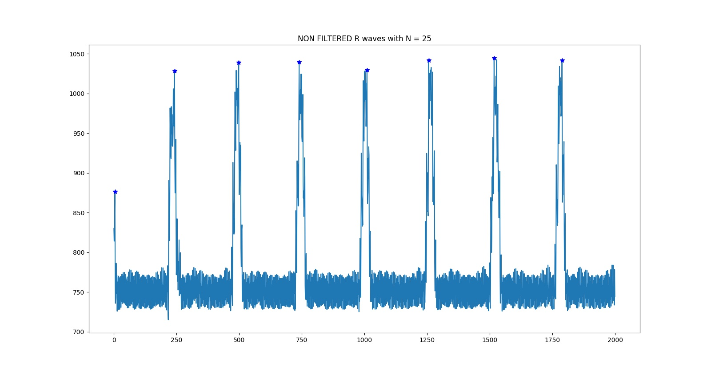
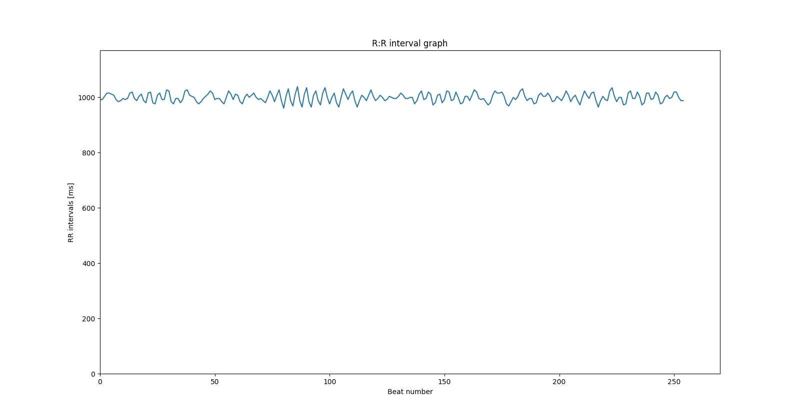

# Biomedical Engineering Assignment 1
## Name: Abdelrahman Mohamed Abdelhamid Ali Elbehery
## Section : 2
## ID : 1300759

<!-- TOC -->
## Table of contents
- [How to use](#how-to-use)
- [Class diagram](#class-diagram)
    - [Attributes](#attributes)
    - [Methods](#methods)
- [Code features](#code-features)
    - [Algorithms implemented **from scratch** are](#the-algorithms-that-i-have-implemented-from-scratch-are)
    - [Built-in algorithms used](#the-built-in-algorithms-used-are)
- [Algorithms details](#algorithms-details)
    - [5 Point difference algorithm](#5-point-difference-algorithm)
    - [Moving average](#moving-average)
    - [Threshold value calculation](#threshold-value-calculation)
    - [R-peak detection](#r-peak-detection)
- [Deliverables and outputs](#deliverables-and-outputs)
    - [Problem 1](#problem-1)
        - [Before_After_Filter.jpg](#before_after_filterjpg)
        - [DetectedR_5.jpg](#detectedr_5jpg)
        - [DetectedR_15.jpg](#detectedr_15jpg)
        - [DetectedR_25.jpg](#detectedr_25jpg)
        - [What can you conclude about the optimal setting of N?](#what-can-you-conclude-about-the-optimal-setting-of-n)
        - [Unfiltered_25.jpg](#unfiltered_25jpg)
        - [RR.jpg](#rrjpg)
    - [Problem 2](#problem-2)
        - [MissingBeats.txt](#missingbeatstxt)
- [References](#references)

<!-- /TOC -->
## How to use
+ You need a `python 2.7 interpreter`
+ From terminal type `python code.py`
    + Note the code assumes `/data_set/Data2.txt` and `/data_set/DataN.txt` exist at the relative directory `/data_set` otherwise the proper directory should be given at the class constructor and methods
+ The output images are generated at the same directory of the code file `code.py`

---

## Class diagram

The code implements a single class `ECG_Filter` that utilizes an ECG signal filter and Sinus arrest detector.

The filtration part of the ECG algorithm involves the following

1. Notch filter to remove the power-line noise followed by a BPF
2. A 5 point difference to check large slope regions
3. Square the difference array to poroduce positive samples
4. Average window algorithm is applied to the samples for a smoother curve
5. Threshold is assigned to capture the QRS [the R peak]



### Attributes

+ `data` : np.array that contains the sampled ECG data, exist only for visualization
+ `data_filtered` : np.array that contains the data after applying the first BP+Notch filters
+ `data_filtered_avg` : np.array that contains the sampled filtered data after applying
moving window with size N
+ `r_peaks` : np.array that contains the peak indices of the ECG [R portion]
+ `rr_interval` : np.array that contains the R peaks difference in time [sec]
+ `missing_beats` : np.array that contains the exact time of missing beats [sec]
+ `time_stamp` : np.array that contains the time of each R peak
+ `f_sampling` : float represents the sampling frequency
+ `threshold` : an automatically generated value used as the signal threshold to detect peaks

### Methods

+ `ECG_Filter` : the class constructor
+ `filter_avg` : filter with average window and 5-point difference algorithm
+ `detect_sinusArrest` : sinus arrest detection algorithm

---

## Code features

### The algorithms that i have implemented **from scratch** are

+ 5 Point difference algorithm
+ Moving average technique with N as an argument
+ Threshold value calculation
+ R-peak detection algorithm

The details of each algorithm are illustrated at the next section

### The built-in algorithms used are

+ `sympy.signal.iirnotch` : to generate the notch filter components
+ `sympy.signal.butter` : to generate the band pass filter components
+ `sympy.signal.lfilter` : to apply the filter over the signals

---

## Algorithms details

### 5 Point difference algorithm

The algorithm uses `numpy.array` data-structure to perform vector operations on the data read after applying all the filter `data_filtered[]` by doing the following set of vector operations

```py
self._data_filtered = (self.f_sampling/(8.0)*(-self.data_filter[2:-2-\
2*self.data_filtered[1:-3] + 2*self.data_filtered[3:-1] + self.data_filtered[4:]))**2
```

### Moving average

```py
# for zero indexing
avg_window_size -= 1

# take the current sub-array from the filtered data as the window
self.data_filtered_avg = np.copy(self._data_filtered[avg_window_size:])

# Vector operation per window size to sweep and add all the array items together
for i in range(avg_window_size):
    self.data_filtered_avg += self._data_filtered[i:-avg_window_size+i]
self.data_filtered_avg /= avg_window_size

# prepare the array of peaks
self.r_peaks = np.zeros([self.data_filtered_avg.shape[0],])
```

The algorithm loops through the sampled data items and it moves by a step `avg_window_size`. The algorithm will always select the highest peak within the average window as the R-peak

---
### Threshold value calculation
```py
# threshold percentage 60%
th_ratio = 0.6
self.threshold = th_ratio*np.max(self.data_filtered_avg)
```

The threshold is `60%` of the maximum peak in the moving average window. the rule seemed to work well for the given data-set and is taken from \[1\]

### R-peak detection

```py
## peak detection
for i in range(0, self.data_filtered_avg.shape[0], avg_window_size):
    # get the peak value from the current window
    max_idx = np.argmax(self.data_filtered_avg[i:i+avg_window_size])+i
    # if a peak propagates from the past window handle it
    if i >= avg_window_size:
        past_max_idx = np.argmax(self.r_peaks[i-avg_window_size:i])+(i-avg_window_size)
    else:
        past_max_idx = 0
    # current and past peaks 
    val = self.data_filtered_avg[max_idx]
    past_val = self.r_peaks[past_max_idx]
    # select a peak and do TH comparison
    val = val * (val > self.threshold) * (val > past_val)
    past_val = past_val * (past_val > val)
    # update the peak array
    self.r_peaks[max_idx] = val
    self.r_peaks[past_max_idx] = past_val
```
The algorithm iterates through the sampled data moving by window size, selects the current peak and stores its amplitude at `r_peaks`, note that this array does contain `numpy.nan` for the indices that does not have a peak.

---

## Deliverables and outputs

### Problem 1
#### Before_After_Filter.jpg



#### DetectedR_5.jpg



#### DetectedR_15.jpg



#### DetectedR_25.jpg



#### What can you conclude about the optimal setting of N?
> The more the value of N the more accurate the peaks are detected, if N is small we might detect false R-peaks as in the image where `n=5`

#### Unfiltered_25.jpg



#### RR.jpg


### Problem 2

#### MissingBeats.txt

For N = 15

```
876
2185
5041
```

---
## References

[\[1\] Gacek A. (2012) An Introduction to ECG Signal Processing and Analysis. In: Gacek A., Pedrycz W. (eds) ECG Signal Processing, Classification and Interpretation. Springer, London
](https://link.springer.com/chapter/10.1007/978-0-85729-868-3_2)
